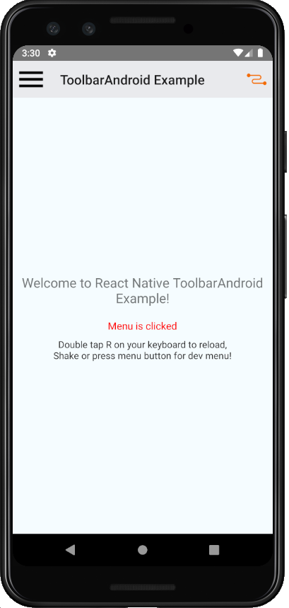

# `@react-native-community/toolbar-android`
[](https://circleci.com/gh/react-native-toolbar-android/toolbar-android/tree/master)   [](https://www.npmjs.com/package/@react-native-community/toolbar-android) [](https://github.com/facebook/react-native/issues/23313)

## What is it?
A React component that wraps the Android-only [Toolbar widget](https://developer.android.com/reference/android/widget/Toolbar). 

This is extracted from react-native per [lean core](https://github.com/facebook/react-native/issues/23313) initiative, which removed `ToolbarAndroid` at v0.61. The goal of this repo is to house the original component and continue to improve and maintain a lean wrapper with zero dependency other than react and react-native.




## Getting started

`yarn add @react-native-community/toolbar-android`

or

`npm install @react-native-community/toolbar-android --save`

Now link the native code with your project:

```
# RN >= 0.60
npx pod-install

# RN < 0.60
react-native link @react-native-community/toolbar-android
```

### Manual installation

<details>
<summary>Manually link the library on Android</summary>
   
#### `android/settings.gradle`
```groovy
include ':react-native-community-toolbar-android'
project(':react-native-community-toolbar-android').projectDir = new File(rootProject.projectDir, '../node_modules/@react-native-community/toolbar-android/android')
```

#### `android/app/build.gradle`
```groovy
dependencies {
   ...
   implementation project(':react-native-community-toolbar-android')
}
```

#### `android/app/src/main/.../MainApplication.java`
On top, where imports are:

```java
import com.reactnativecommunity.toolbarandroid.ReactToolbarPackage;
```

Add the `toolbar-android` class to your list of exported packages.

```java
@Override
protected List<ReactPackage> getPackages() {
    return Arrays.asList(
            new MainReactPackage(),
            new ReactToolbarPackage()
    );
}
```
</details>

## Migrating from the core `react-native` module
This module was created when the ToolbarAndroid was split out from the core of React Native. To migrate to this module you need to follow the installation instructions above and then change you imports from:

```javascript
import { ToolbarAndroid } from 'react-native';
```

to:

```javascript
import ToolbarAndroid from '@react-native-community/toolbar-android';
```

## Usage

see [ToolbarAndroid](./doc/toolbarandroid.md)                                                             

## Contributors

This module was extracted from `react-native` core.

## License
The library is released under the MIT licence. For more information see `LICENSE`.
